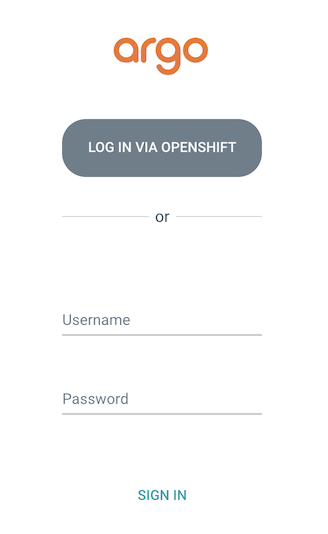

# Setup GitOps Control Panel
  
To setup a GitOps control panel, let's install OpenShift GitOps Operator from Operator Hub in an OpenShift cluster. Log into an OpenShift cluster using your account, navigate to `Operators -> OperatorHub`, then search `Red Hat OpenShift GitOps`.

Open the tile and click `Install` button. After waiting for a while, you should have your OpenShift GitOps Operator ready for use. Open the menu on the top right side of your OpenShift Console, then choose `Cluster Argo CD`. This will bring you to the Argo CD login page.

 

To login Argo CD from UI, you can choose the option "Log in via OpenShift" on the login page, so that you can keep using the same login credential that is used to authenticate OpenShift Console.

For the first time that you login using this option, you will need to grant the permission that allows OpenShift GitOps to access your OpenShift account, just click the `Allow selected permissions` button.

Alternatively, you can also use the default admin account provided by Argo CD itself to login. To get the password, navigate to OpenShift Console, click `Workloads -> Secrets`, select `openshift-gitops` project, find a secret called `openshift-gitops-cluster`, then copy the content in its data field with key `admin.password`.

