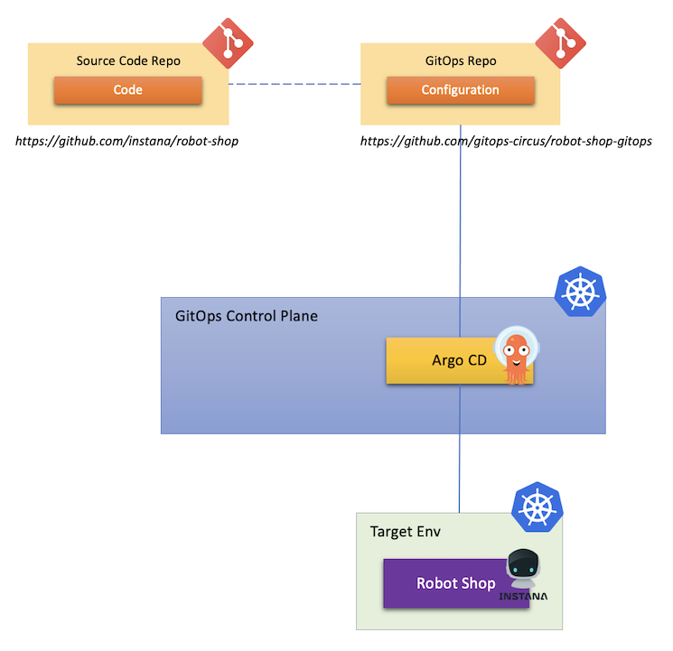
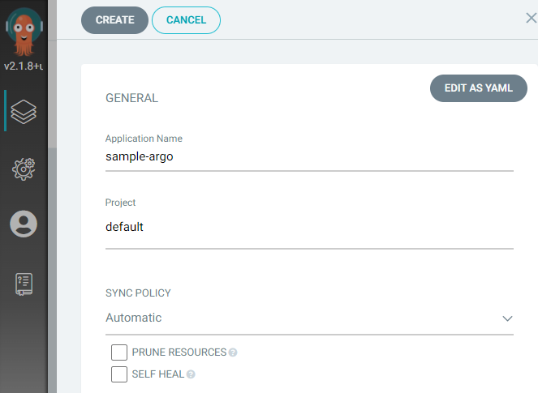
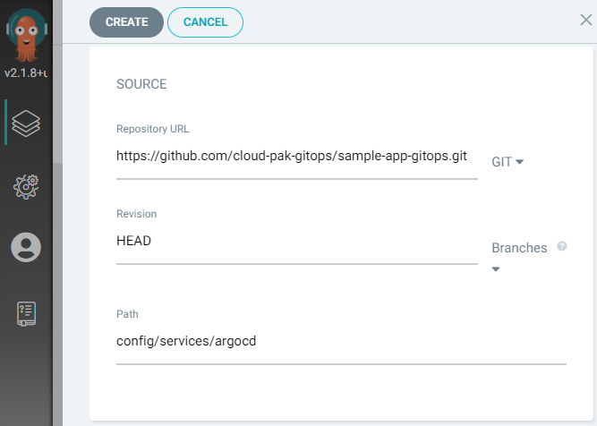
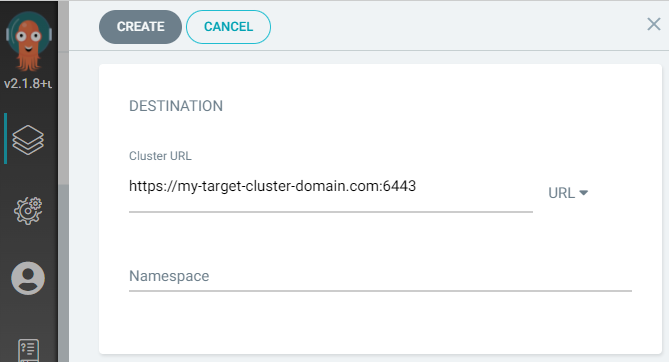
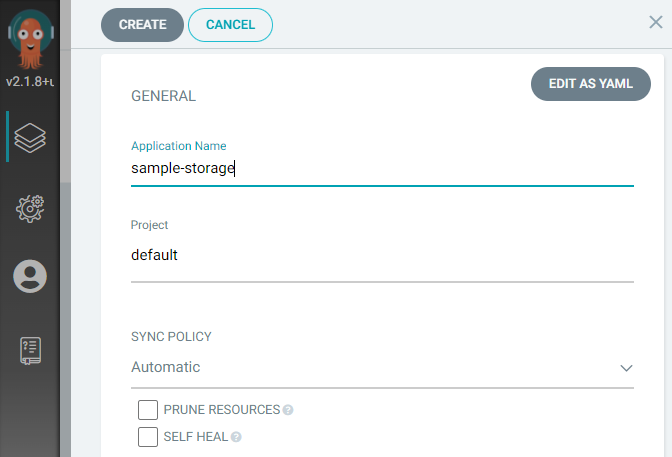
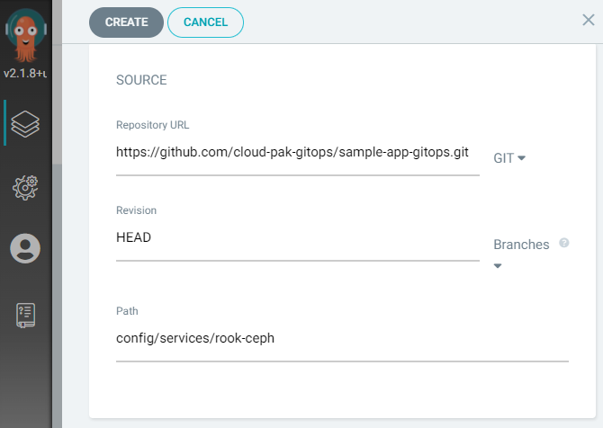
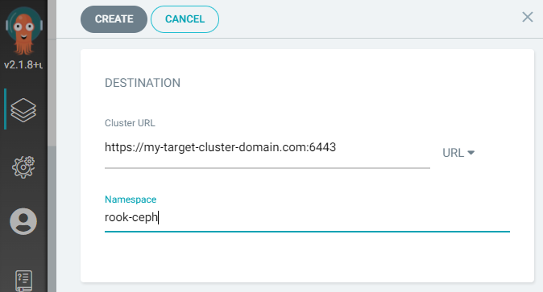
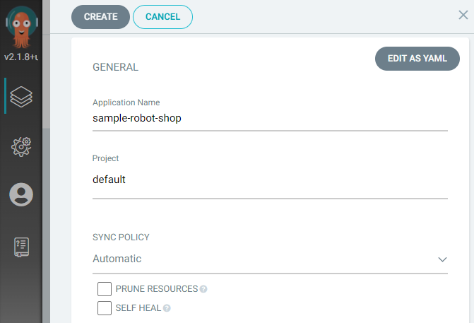
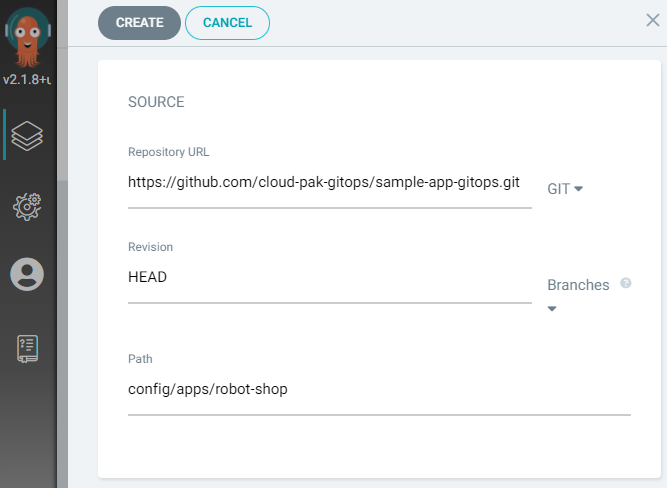

<!-- START doctoc generated TOC please keep comment here to allow auto update -->
<!-- DON'T EDIT THIS SECTION, INSTEAD RE-RUN doctoc TO UPDATE -->
**Table of Contents**  *generated with [DocToc](https://github.com/thlorenz/doctoc)*

- [Introduction](#introduction)
- [Deploying Application](#deploying-application)
  - [Description](#description)
  - [Tools](#tools)
  - [Instructions](#instructions)
    - [Setup GitOps Control Panel](#setup-gitops-control-panel)
    - [Deploy with Command Line](#deploy-with-command-line)
      - [Prepare Environment](#prepare-environment)
      - [Deploy Robot Shop](#deploy-robot-shop)
    - [Deploy with Gitops UI console](#deploy-with-gitops-ui-console)
      - [UI Configure Argo CD](#ui-configure-argo-cd)
      - [UI Setup Storage](#ui-setup-storage)
      - [UI Deploy Robot Shop](#ui-deploy-robot-shop)
- [Access Application](#access-application)
- [Uninstall Application](#uninstall-application)

<!-- END doctoc generated TOC please keep comment here to allow auto update -->

# Introduction

For both simplicity and consistency, all tutorials and working demos are designed using a single unique sample application, [Robot Shop](https://github.com/instana/robot-shop), which is small enough to run on a developer’s laptop but still have enough complexity to be interesting and not just a “Hello World” example.

Another reason to choose Robot Shop as sample application is that it includes all required components installed and configured for native observability which provides automatic instrumentation for complete end to end tracing and visibility into time series metrics supported by [Instana](https://www.instana.com/). This closes the gap of application deployment in production environment using GitOps by verifying the system status via application metrics.


# Deploying Application

## Description

This scenario is aimed to demonstrate how you can define the desired states for an application in a Git repository, then use GitOps tools to deploy the application to a target environment and keep the actual states and desired states in sync.

As an example, in this document, we will use Robot Shop as a sample application and use Argo CD to deploy it to a cluster.



## Tools

* OpenShift
* OpenShift GitOps (Argo CD)
* Helm

## Instructions
  
  A Quick Video Tutorial is available online to demonstrate the deployment process [https://youtu.be/B_UY0JWFFSE](https://youtu.be/B_UY0JWFFSE).

### Setup GitOps Control Panel
First a ArgoCD Gitops server need to be set up, if you haven't done so, you can refer to [GitOps control panel set up instruction](Doc/GitOps-control-panel-set-up-instruction.md) to set it up.  

### Deploy with Command Line

#### Prepare Environment

Before you can deploy the application using GitOps, you need to prepare the environment first which is one off work. For example, to configure Argo CD with custom settings, to prepare storage for your application persistence, and so on. All these work can also be completed using GitOps.

In our case, we defined some customized health checks for Kubernetes custom resources that are not supported in Argo CD by default. We also use [rook-ceph](https://rook.io/) as the storage provider to provision persistent volume automatically for our application. All these configuration are stored inside the environment configuration repository.

To simplify the scenario, we will apply these configuration to the cluster that runs the Argo CD instance, so that the application will also be co-located with Argo CD in the same cluster.

Following steps need to be performed to prepare environment:
- Set environment variables.  
  - Replace the `<my-target-cluster-domain>` in below command with your own domian name. 
  - Use `TARGET_CLUSTER=https://kubernetes.default.svc` instead if you plan to deploy to the local cluster.
  - When the target cluster is a remote cluster, a argocd instance also need to be installed in the target cluster before hand.
```shell
GIT_REPO='https://github.com/cloud-pak-gitops/sample-app-gitops.git'
TARGET_CLUSTER='https://<my-target-cluster-domain>.com:6443'
```

- Configure Argo CD
```bash
argocd app create sample-argo --repo $GIT_REPO \
  --dest-server $TARGET_CLUSTER \
  --sync-policy automated \
  --revision HEAD \
  --path config/services/argocd
```
  
- Setup Storage  
Skip this step if you already have persistent storage configured in the target cluster.
```shell
argocd app create sample-storage --repo $GIT_REPO \
  --dest-server $TARGET_CLUSTER \
  --sync-policy automated \
  --revision HEAD \
  --path config/services/rook-ceph
```
rook-cepth storage deployment will take a while, usually over 15 minutes.  
Use below command to check the rook-ceph deployment status in the target cluster, once deployment completed, all pods should be showing status `Running`.
```shell
oc get pod -n rook-ceph
```
#### Deploy Robot Shop 

```shell
argocd app create sample-robot-shop --repo $GIT_REPO \
  --dest-server $ARGO_CLUSTER \
  --sync-policy automated \
  --revision HEAD \
  --path config/apps/robot-shop
```
Use below command to check the robot-shop deployment status in the target cluster, once deployment completed, all pods should be showing status `Running`.
```shell
oc get pod -n robot-shop
```
### Deploy with Gitops UI console
  
In this example, we will use `https://my-target-cluster-domain.com:6443` as the example target cluster for the deployment, replace it with your own target cluster when performing deployment.  

#### UI Configure Argo CD
In Argo CD application management, click `NEW APP` button.
- Genrnal section
  - privide a name of your application, for example,  `sample-argo`
  - select desired Project for the deployment, the default project is `default`.
  - Sync policy set to `Automatic`  
  
- Source section
  - Repository URL, use `https://github.com/cloud-pak-gitops/sample-app-gitops.git`
  - Revision, use `HEAD`
  - Path, use `config/services/argocd`  
  
- Destination section
  - Cluster URL, provide the target cluster URL, example - `https://my-target-cluster-domain.com:6443`
  - Namespace, leave blank.  
    
Click on `CREATE` to create the app.  

#### UI Setup Storage
In Argo CD application management, click `NEW APP` button.
- Genrnal section
  - privide a name of your application, for example,  `sample-storage`
  - select desired Project for the deployment, the default project is `default`.
  - Sync policy set to `Automatic`   
  
- Source section
  - Repository URL, use `https://github.com/cloud-pak-gitops/sample-app-gitops.git`
  - Revision, use `HEAD`
  - Path, use `config/services/rook-ceph`  
  
- Destination section
  - Cluster URL, provide the target cluster URL, example - `https://my-target-cluster-domain.com:6443`
  - Namespace, use `rook-ceph`.  
    
Click on `CREATE` to create the app.  
  
rook-cepth storage deployment will take a while, usually over 15 minutes.  
Use below command to check the rook-ceph deployment status in the target cluster, once deployment completed, all pods should be showing status `Running`.
```shell
oc get pod -n rook-ceph
```
#### UI Deploy Robot Shop 
In Argo CD application management, click `NEW APP` button.
- Genrnal section
  - privide a name of your application, for example,  `sample-robot-shop`
  - select desired Project for the deployment, the default project is `default`.
  - Sync policy set to `Automatic`  
  
- Source section
  - Repository URL, use `https://github.com/cloud-pak-gitops/sample-app-gitops.git`
  - Revision, use `HEAD`
  - Path, use `config/apps/robot-shop`  
  
- Destination section
  - Cluster URL, provide the target cluster URL, example - `https://my-target-cluster-domain.com:6443`
  - Namespace, use `robot-shop`.  
    
Click on `CREATE` to create the app.  
  
Use below command to check the robot-shop deployment status in the target cluster, once deployment completed, all pods should be showing status `Running`.
```shell
oc get pod -n robot-shop
```
# Access Application

To access the application, you can go back to the OpenShift Console, and open the menu on the top right side of the page. There will be a new menu item added for the application that we created just now.


Click that menu item will bring you to the application home page.


Congratulations! You have successfully deployed the sample application Robot Shop using GitOps.

# Uninstall Application

To uninstall the application, choose the Application named `sample-robot-shop` from Argo CD `Applications` page, then click `DELETE` button. This will bring down the application. Wait for a while till the Application along with its child Applications are all completely deleted, then go to check the menu on the top right side of OpenShift Console, you will see the menu item for the application has been removed.
